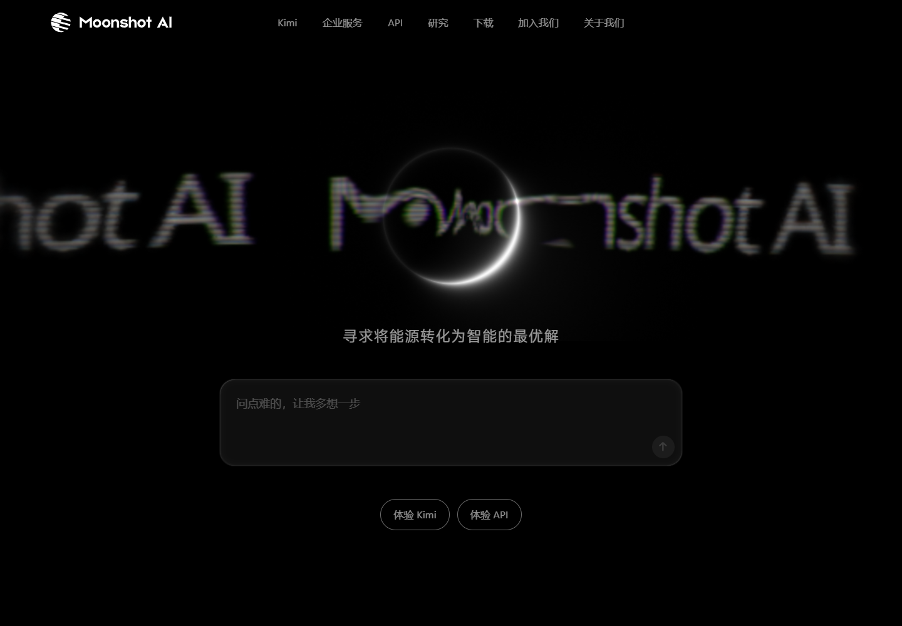

# UI 完成度参考观察

日期：2026-09-27。来源：[Moonshot 官方网站](https://www.moonshot.cn/)。

用户明确要求：它只代表最终设计成熟度，不模仿品牌、布局、颜色、页面结构或视觉元素。

本次通过独立的无登录浏览器配置读取网站并截取 1440 × 1000 桌面首屏，已实际查看图像。可观察到：清楚的视觉重心、很少但明确的动作入口、可控的字级与留白、统一的图形处理。这些只支持静态首屏观察。

没有声称已检查其完整动效、移动端适配、跨页一致性或实际任务完成表现；这些属于用户要求的本产品质量目标，不能仅凭参考网站首图宣称已达成。

这张截图没有作为 image_gen 视觉参考输入，以免将品牌和图形带入本产品；新候选由产品任务、非矩形/小尺寸约束和内部探索产生。
