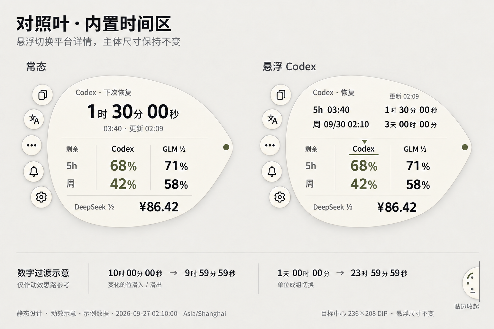

# 视觉与交互定义

状态：v0.4 起的设计演进记录；最终 M1 基线已于2026-09-30 Freeze，当前局部修订见第11节。最初定义日期：2026-09-27。  
用户后续已授权 M1；现有设计定义、静态图和单窗口可运行原型，实际验证边界见 [M1-REPORT.md](M1-REPORT.md)。当前 M1 视觉基线已于 2026-09-30 UI Freeze，见 [冻结记录](M1-FREEZE.md)。下方探索与候选段保留历史；后续实现继承最终 B3／A44／H3／T2 与单轮廓交接，不重新设计。

M1 已于2026-09-30经独立 Round 4 与用户确认 UI Freeze，见 [冻结记录](M1-FREEZE.md)。下文保留 M1 设计演进记录。2026-09-30 用户另行授权四颗常用复制球并保留更多文本，以及将应用名改为 usage；最新局部规格见第11节，核心叶形／额度图形／色彩／字体系统继承冻结基线。

## 1. 已确定的融合

| 保留或更新 | 本轮定义 |
| --- | --- |
| B 的视觉 | 温白叶形、近黑数字、橄榄色强调、克制细线与五个外围球 |
| B 的信息组织 | 五小时/周为行，Codex/GLM为列，DeepSeek为独立余额基线 |
| C 的交互逻辑 | 主体内部预留固定时间区，悬浮平台时替换该区内容 |
| 用户新增要求 | 长时间天/时/分，短时间时/分/秒；数字更新、位数增减、单位变化有动效 |
| 悬浮约束 | 不向外延展独立明细块；主体、主数、单位锚点和功能球位置保持稳定 |

当前维护用户选定的 B+C 融合方向。旧候选图和版本归档已按要求移除；本文及配套动效规格完整定义当前方案。

[Moonshot](https://www.moonshot.cn/)仍仅代表完成度标尺，不是品牌、配色、构图或图形来源。[参考观察](docs/design/references/REFERENCE_NOTES.md)的证据只覆盖当时查看的静态首屏。

## 2. 融合静态稿

左右分别是同一窗口的常态与 Codex 详情态；右图的触发区是下方 Codex 列（列名、五小时和周剩余额度及列内留白）。下方是数字变化示意，所有数据均为示例。

静态图中的“Codex · 下次恢复”没有标出具体窗口；当前文字规范补为“Codex · 5h 恢复”或“Codex · 周恢复”。原图尚未重绘，也未呈现功能球的入场动画；以本文定义为准，动效由 M1 原型验证。

主体暂定236 × 208DIP，比B原先228 × 172的预算宽8、高36DIP。新增的是常态就存在的内部时间空间；悬浮时不再改变外围尺寸。包含五球的整体目标不超过约300 × 300DIP，最终要在精确稿及原型验证。不能用生成图的尺寸标注替代实测。

如果目标大小下装不下完整时间，先收紧留白、校准列宽和字级；不恢复成外接大面板，也不隐藏三家概要。

## 3. 内部布局与状态

上部是固定时间区，预算约190–194DIP宽；下部是固定的额度对照表和余额基线。通过一条细线/留白区分，内部不再套卡片。

### 常态

时间区默认聚焦四个额度窗口中剩余百分比最低的已知值，固定显示平台、窗口、百分比、可用的三单位恢复倒计时、绝对时刻及更新时间。示例文案为“最低 · Codex 5h”“8% / 1时30分00秒”“恢复 03:40 · 更新 02:09”。主数是额度，倒计时并列但低一级。周额度最低时标题改为“最低 · Codex 周”；GLM 按来源使用“下次补回”等真实语义。

| 读数 | 含义 |
| --- | --- |
| 8% / 1时30分00秒 | 所选窗口剩余百分比 / 距恢复还剩多久；当前示例时刻是02:10 |
| 恢复 03:40 | 平台给出的本次预计恢复时刻；跨日时补日期 |
| 更新 02:09 | 本工具最近成功读取该平台数据的时刻 |

“恢复”与“更新”始终区分。时间走到零不证明额度已经补回，也不是要求用户等待倒计时才更新数据。

默认排序只比较来源已知的四个剩余百分比，未知值不当作零；相同数值优先 5h，再优先 Codex。GLM 周额度若最低，即使缺恢复时间仍呈现额度主数，倒计时槽明确写“未提供”。DeepSeek 余额不产生额度百分比或恢复事件。到点后保持待确认，取得新快照后再判断，不自行补满额度。

### 悬浮或键盘聚焦 Codex / GLM

鼠标停在下方对应平台的整列概要上：列名、五小时剩余量、周剩余量及列内留白都可触发，命中范围不越入相邻平台。初始悬浮意图130ms后先轻强调该列，再用约170ms替换顶部时间内容；无需点击。键盘聚焦同一平台列取得相同详情。上方时间区是阅读区，不承担下方平台列的选择入口。

例如，悬浮 Codex 列的“Codex”“68%”或“42%”均进入右图状态。只替换同一个内部时间区：

- 顶行：当前平台与最近成功更新时间。
- 五小时行：窗口标记、绝对恢复时刻、三单位倒计时。
- 周行：日期及绝对时刻、三单位倒计时。

整列额度轻强调并与上部平台名称对应。上下两条概要、另一平台数值、余额和操作球不挪动。没有单独延展块、引线或外部时间提示。

GLM如果只提供下一批补回就标“下次补回”；未知字段显示“未提供”。不能为了两行齐全而编造恢复时刻。

### 悬浮 DeepSeek

固定时间区改为余额信息、更新时间与常态优惠解释，不出现虚构的5h/周重置。下部金额和币种依然可见。

### 退出 / 固定

从所选平台列移到上方时间区或二者之间的合理路径时，保留该平台详情，方便连续阅读。离开这一阅读区域后才启动明细退出延时；若改指另一平台，按其意图阈值切换。鼠标点击平台列或叶片空白不锁定浮窗，移出后仍按延时收起；键盘焦点可持续查看，Esc 返回默认。明细退出与整个贴边窗口收起是两套独立状态。后续固定展开作为独立显式操作处理，原有拖动、托盘和四边适应规则继续保留。

## 4. 三单位倒计时

初始分界采用24小时：

| 剩余时长 | 显示 | 例 |
| --- | --- | --- |
| >=24h | 天 / 时 / 分 | 3天00时00分 |
| <24h | 时 / 分 / 秒 | 1时30分00秒 |
| <1h | 仍显示三个单位 | 0时59分59秒 |

首个数值不补零，后两个数值各两位。绝对时刻仍用 HH:mm 或 MM/DD HH:mm。未知时间显示未提供；到零为0时00分00秒并标待确认。

倒计时以真实恢复时间和当前时间计算，不增加每秒API请求。两个窗口使用同一时刻的计算结果。优惠标记与额度、余额数值分开，不改变真实配额。

示例统一为2026-09-27 02:10:00（Asia/Shanghai）：Codex5h于03:40恢复、周于09/30 02:10恢复，数据更新02:09；Codex68%/42%、GLM71%/58%、DeepSeek¥86.42均是假数据。

## 5. 数字、位数和单位的动效

| 情况 | 设计行为 |
| --- | --- |
| 59→58 | 只动画变化的字位：旧字上移淡出，新字从下方进入；约160ms |
| 10时→9时 | 退出十位，个位同时过渡；预留槽不收窄，单位和其余内容不动 |
| 1天00时00分→23时59分59秒 | 整个三单位组一起切换，约180ms；不逐个换单位造成混合态 |
| 切换平台 | 标题、时间、单位与更新时刻作为一个内容块淡换；不播放跨平台逐位滚动 |
| 休眠/校时/新恢复时刻 | 直接过渡到当前完整结果，不快速回放积压秒数 |
| 减少动态效果 | 去掉位移，用短淡入或即时替换，仍保留反馈 |

每个倒计时有三个固定数字/单位槽，使用等宽数位、右对齐和固定单位锚点。新增字位从预留空位进入，消失字位退回空位。数字总宽、字体大小和容器尺寸不会随数值变化反复伸缩。

变化涉及借位时，各个变化字位同时开始。动画中收到新状态则合并到最新，不排队。范围限制在时间区，不使用三维翻牌、老虎机式长滚动或持续发光。

[完整动效与边界规格](docs/design/COUNTDOWN_MOTION.md)

## 6. 贴边展开与功能球动效

交互顺序：贴边小球/半球 → 悬浮展开中心与半圈功能球 → 悬浮平台列切换内部详情 → 离开整个工具后延时缩回。第二张静态图对应第三步；功能球的出现发生在第二步。

### 6.1 进入

鼠标进入屏幕边缘可见的小球/半球，停留约100ms后开始展开。以开始展开为0ms，暂定以下节奏；时长是设计建议，需 M1 实测收敛。

| 部分 | 开始时间 | 过程与结束 |
| --- | --- | --- |
| 中央信息区 | 0ms | 向屏幕内舒展开，约220ms到位 |
| 5个功能球 | 40 / 60 / 80 / 100 / 120ms | 沿半圈固定顺序入场，各约160ms；最后一个在280ms到位 |

每个功能球从靠近主体外缘、距其最终位置约10–14DIP处，沿短弧向自己的半圈位置舒展；透明度0→1，缩放0.88→1，平稳减速。它们有清楚的出现过程，不是中心展开后突然整圈显示，也不只是在展开结束后提供选中反馈。图标保持正向，不绕中心长距离旋转、不弹跳。

右边缘原型以沿半圈从上到下的固定顺序入场；其他边缘按向内布局适配，不改变功能顺序。入场不会扩大既定的整体尺寸预算。球到位后启用固定36DIP命中区；运动阶段不接受动作点击。完全隐藏的球没有命中区，不能截获桌面点击。

### 6.2 离开与反转

指针离开中心、功能球、提示、菜单及合理移动走廊的整体区域后，等待700ms再收起；等待期间回来立即取消。收起时按入场的相反顺序回收功能球：首球立即开始，后续间隔15ms，各约120ms，整组在180ms内完成。球沿短路径回到靠近主体外缘的位置，淡出并缩至0.88；中心同时用约180ms退回贴边小球。

收起途中返回，从当前位移、缩放和透明度平滑反转；不跳回起点、不重播完整队列。最终仅保留小球/半球。穿过中心到功能球之间的间隙不能误触收起；逻辑鼠标走廊只维持展开，不能成为拦截桌面的透明矩形。Qt mask仍需Windows原型验证。[Qt输入区域](https://doc.qt.io/qt-6/qwindow.html#setMask)

### 6.3 到位后的反馈与减少动态效果

- 平台：意图约130ms、列强调约90ms、内部内容切换约170ms；不改变轮廓或主表坐标。
- 功能球：入场完成后位置固定，指向某球时约110ms填色/描边，最多1.04局部缩放；用户填写的说明短淡入，命中区域和相邻球位置不变。
- 减少动态效果：取消展开中的空间位移、缩放及错峰序列，中心和球以不超过约100ms的短淡入/淡出或即时状态替换出现；仍保留可识别反馈。
- 悬浮不抢其他应用焦点；只有剪贴板写入成功才显示已复制，不自动粘贴。
- 数字动效仅作用于时间区，不驱动功能球；功能球进出场仅作用于贴边展开/收起，不在每次切换平台时重播。

## 7. 字体、球和跨屏一致性

标签/正文12–13DIP，概要主数16–18DIP，悬浮倒计时约14DIP；常态优先显示最低百分比，倒计时约13DIP并列补充。中文字体与数字字宽必须在实际Qt环境、DPI和目标设备验证。最多两套字体；文字对比度目标4.5:1。[对比度参考](https://www.w3.org/WAI/WCAG22/Understanding/contrast-minimum.html)

五球暂定两个具名复制、更多文本、提醒、设置；可见约28DIP、命中约36DIP，不能重叠。采用同一图标笔画和重心。用户可填写名字和短说明，正文继续通过系统记事本编辑。

原建议收起球40–44 DIP、半球外露22–26 DIP。用户设备实测认为此宽度难辨，M1 曾选直径72 DIP、外露38 DIP 的 D38 双表盘；进一步发现优惠符号太小，当前 A44 候选外露44 DIP。两家额度概况、DeepSeek余额状态、两家独立优惠标记和未读提醒在可见区域编码，最终原尺寸观感仍待实际验收。

四边向屏幕内展开，文字保持正向；左侧镜像右侧构图，顶部五球在叶片下方，底部五球在上方；多屏接缝不默认吸附。设置使用正常分区表单，延续同一字级、颜色、图标和反馈。主窗通过Visual Prototype之后逐区扩展。

## 8. M0／M1 历史交付与演进

M0 完成融合静态稿、版式预算、三单位规则和逐位动画定义。M1 随后实现了单窗口示例数据原型、动画与程序化 Qt 验证；用户已在一块 150% 物理屏幕完成四边拖动和悬浮操作，混合 DPI 与独立视觉复审仍未完成。

用户已明确授权 M1；当前只实现一个真实顶层窗口、四边贴靠、示例数据和一条交互链。程序化逐帧抓取已覆盖五球入场/反转、Codex 详情和复制反馈，可控时钟已验证 10→9 与 24h 单位变化；当前哈希已有四边实际鼠标录屏，多屏 DPI 和独立观感复审仍是视觉 Freeze 门槛。详见 [M1-REPORT.md](M1-REPORT.md)。

- [融合稿生成记录](docs/design/CONCEPT_PROMPT.md)
- [SPEC](SPEC.md)、[PLAN](PLAN.md)、[DECISIONS](DECISIONS.md)、[TEST_PLAN](TEST_PLAN.md)

## 9. B3 展开与 A44 收起额度图形（M1 演进记录；最终已 Freeze）

Critic 与用户都确认旧版细轨不足以让人不读百分比就判断资源状态。保留温白真叶形、近黑数字、橄榄色、三家常显、固定内部详情及五球位置；重建资源对照区的图形主次。[展开 16→3 筛选]（本机验收资料）后用户选定 B3；收起态经[放大 16→3 筛选]（本机验收资料）选择 D38 双表盘，再经[优惠标记 16→3 筛选]（本机验收资料）选择 A44。真实识别、动效与多状态验收仍未完成。

| 图形 | 稳定含义 |
| --- | --- |
| 收起球上方 C 完整表盘 | Codex 的 5h／周最低已知剩余；贴右边时 C 在表盘左侧，贴左边时镜像在右侧，中心 H（5h）或 W（周）标明窗口 |
| 收起球下方 G 完整表盘 | GLM 的 5h／周最低已知剩余；G 与 C 遵循同一朝向规则，中心 H（5h）或 W（周）标明窗口 |
| 展开后 Codex/GLM 名称下的半圆轨 | 各自 5h 剩余比例；数值落在弧线开口的中心。收起表盘代表 5h 时在此交接 |
| 各平台半圆轨下方的轻曲线 | 各自周窗口剩余比例；周数值紧邻短轨。收起表盘代表周时在此交接 |
| 轨道全长 | 100% 的比例参照；填充长度是本平台本窗口的相对百分比 |
| 短橙段和方端 | 已知且接近耗尽（示例阈值 ≤15%）；形状与长度同时提示，不能只靠颜色 |
| 断续轨、文字“未知” | 来源未提供，不是 0%；收起表盘两窗均未知时用断续环与问号，只有一窗未知时表盘显示另一已知窗口，展开后两窗独立判断 |
| 收起球 `¥` 与展开金额 | DeepSeek 只有余额有无和货币精确值；未知划去 `¥`，不生成余额百分比 |
| 收起球 G 旁与 ¥ 旁的“半” | 分别对应 GLM 积分半耗和 DeepSeek 常态半价；展开后同位置明确写“半耗”“半价”，不使用无归属的斜线或微小分数 |
| 收起球顶部铃形与展开提醒球 | 未读提醒的持续标记；事件到达时短促摆动，减少动态效果时直接呈现静态标记 |

入场时 C/G 完整表盘从收起半球分别移向固定的平台列；代表 5h 的表盘到半弧位置交接，代表周的表盘下行到短轨位置交接，退场沿原路返回。常驻时仪表安静不循环闪动。周/5h 混合场景的逐帧 Qt 截图见[低额度交接]（本机验收资料）及[双周交接]（本机验收资料）；旧 5h 固定表盘抽帧留作历史对照。用户切换示例额度时，已知比例在约 220ms 内短促过渡；未知直接切换断续结构。减少动态效果时立即到目标值。提醒只是 M1 视觉触发演示，调度属于后续里程碑。真实用户识别和物理鼠标感受仍要与脚本抽帧分开判断。恢复时间、更新时间与额度图形彼此分层，三单位倒计时继续保留。

交接的最新复核发现移动表盘曾在约60%进度盖住正在出现的百分比。现将序列收敛为“表盘先到列位 → 完整环交给半弧 → 数字与周轨显现”，收起时反向执行。[最新四态逐帧]（本机验收资料）包含低额度，另有[充足]（本机验收资料）、[中等]（本机验收资料）、[未知]（本机验收资料）。此前半环和数字同起的[旧抽帧]（本机验收资料）保留作对照。叶片刚出现时与右侧收起球的轮廓仍可能短暂叠合，需在实际桌面操作中判断是否干扰。

针对余额金额过度突出，[12→3 字级筛选]（本机验收资料）后当前运行候选用 T2：5h 百分比 11.1 pt，DeepSeek 金额 10.8 pt。只改变数字视觉主次；周读数、时间、标题与轮廓坐标不动。原尺寸舒适度仍待用户确认。

用户进一步要求丰富额度以外的色彩。[16→3 语义配色筛选]（本机验收资料）已把平台、余额、提醒、优惠与选中反馈纳入同一角色映射；H3 草本作为暂定运行候选，仍待用户在 H3/E3/M2 中选择。温白纸色、近黑正文、橄榄轮廓和低额度/未知的形状语义保留。色彩承载识别，但不独自承载任何关键状态。

最新物理操作反馈要求顶部默认追随四窗最低剩余，而非固定 Codex。顶部第一行现在标注平台和窗口，第二行以该窗口百分比为主数、三单位倒计时为辅，第三行给绝对恢复和更新；GLM 周恢复未知时明确留空时间语义。此改动仅触及固定时间槽，B3/A44 图形、三家概要和五球构图不变。[四场景原尺寸实渲染]（本机验收资料）供复核。实际鼠标录屏发现功能球提示会压住叶片，已把提示放到球的外侧，[五球原生提示截图]（本机验收资料）用于核查遮挡。

## 10. 四边停靠的同一视觉系统（M1 演进记录；最终已 Freeze）

用户实际使用发现收起球和展开叶片不能拖动，因此在本窗口补足四边停靠。停靠是同一叶片／双表盘系统的方向变化，不另建页面：右边保留原构图；左边镜像叶形并将五球放右侧；上边叶片向下生长、五球在下；下边叶片向上生长、五球在上。额度表盘的上下顺序、H/W 窗口标记、文字阅读方向和平台／窗口对应关系保持稳定。动作提示随边落在叶片外侧，拖动不执行复制。内容在单一轮廓内逐层出现，底部余额等轮廓接近终态再入场，避免过渡中的越界。

[四边收起／展开原尺寸]（本机验收资料）与[四边五阶段交接]（本机验收资料）展示构图和动效路径。Round 2 哈希还有用户亲自完成的[四边正常速度原生录屏]（本机验收资料）和[关键形态]（本机验收资料）：左／右／上／下均有实际停靠、悬浮及移出，底部拖到自由位置仍保持朝向。当前 Round 3 候选另将八个键盘焦点的高亮、说明和动作统一；顶部停靠的提醒铃移入安全区，摆动也不触边。详见[当前复核包]（本机验收资料）。独立 Critic 的结论尚未返回，不构成 UI Freeze。

## 11. 首版四常用位局部修订与 usage 更名（2026-09-30 用户授权）

用户明确要求显示四颗常用复制球，并继续通过“更多文本”访问其他项；四位配置和实际粘贴均已确认正常。生产版固定次序为复制1–4、更多文本、每日提醒、设置，共七球；核心叶形、三家概要、内部时间槽、B3额度图形、A44收起球、H3角色色和字级保持原规格。`main.py`的五球固定演示入口保留为M1回归基线。

七球沿既有外围曲线排列；左右镜像，上边在叶片下、下边在叶片上。球体仍为31 DIP直径、36 DIP命中直径，相邻命中不重叠；在第四复制与更多文本之间留下组间间距。文字不挪位，展开总时长仍约280ms，将七球的错峰分配到原有入场时间跨度。Tab使用三平台＋七动作，铃铛和复制反馈按动作语义识别，不能再依赖旧数字3。

[150%四边原尺寸截图]（本机验收资料）与100／125／200%渲染回归已完成。用户随后确认四球／GLM值／自动收起及第三、第四球粘贴均正常。更名usage只更改用户可见名称和启动文件，既有内部数据／凭据标识保持连续。
